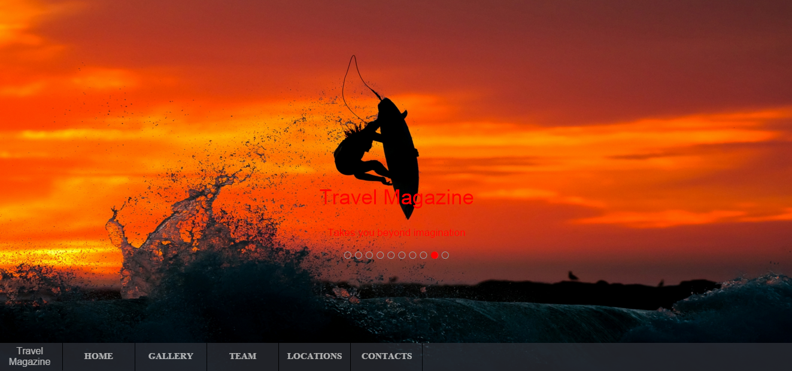

<h1> Travel-Magazine</h1>

<h5>Travel Magazine </h5>is my new project to To demonstrate what I can do and create more work experience 

<h6> Skills used to build this website: </h6>
<ul>
<li> HTML5 </li>
<li> CSS3 </li>
<li> SASS </li>
<li> JAVASCRIPT </li>
<li> JQUERY </li>
<li> Google map API and Twitterr Wedgets </li>
</ul>

Click the the screen shot below to visit Travel Magazine 

  

 big thank you for the amazing ALESSIO ATZENI who inspired my to design and layout travle magazine 

